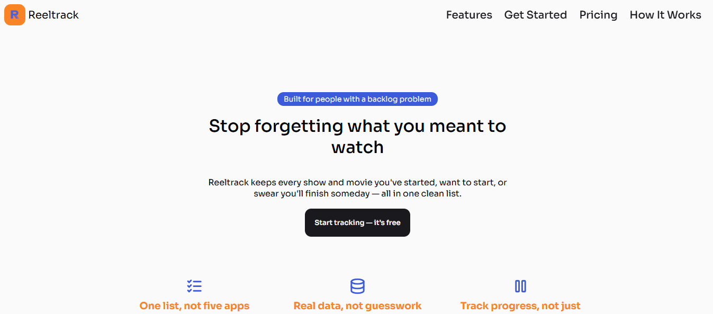

# Reeltrack — Product Landing Page

A responsive product landing page for **Reeltrack**, a TV/movie backlog tracker, built as part of freeCodeCamp's Responsive Web Design certification (Product Landing Page project).

[Live Demo](https://reeltracklandingpage.netlify.app/)



## Overview

Reeltrack's landing page introduces the product — one place to track everything you're watching, want to watch, and haven't finished yet — with a fixed nav bar, hero section, feature highlights, a "how it works" walkthrough, a demo video embed, pricing tiers, and an email signup form.

## Features

- Semantic, accessible HTML structure
- Fixed navigation bar that stays pinned to the top of the viewport
- CSS Grid for feature/pricing card layouts, nested Flexbox for card-internal alignment
- Responsive layout via media query — collapses to a single column on smaller screens
- Hover and transition effects on interactive elements (CTA button, pricing cards, submit button)
- Email capture form with HTML5 validation

## Built With

- HTML5
- CSS3 (Grid, Flexbox, `position: fixed`, media queries, custom properties)
- [Google Fonts](https://fonts.google.com/) — Sora, Red Hat Display
- [Tabler Icons](https://tabler.io/icons)

## Running Locally

```bash
git clone <repo-url>
cd reeltrack-landing-page
open index.html
```

No build step or dependencies required.


## Acknowledgments

Built as part of the [freeCodeCamp Responsive Web Design](https://www.freecodecamp.org/learn/responsive-web-design/) curriculum.
